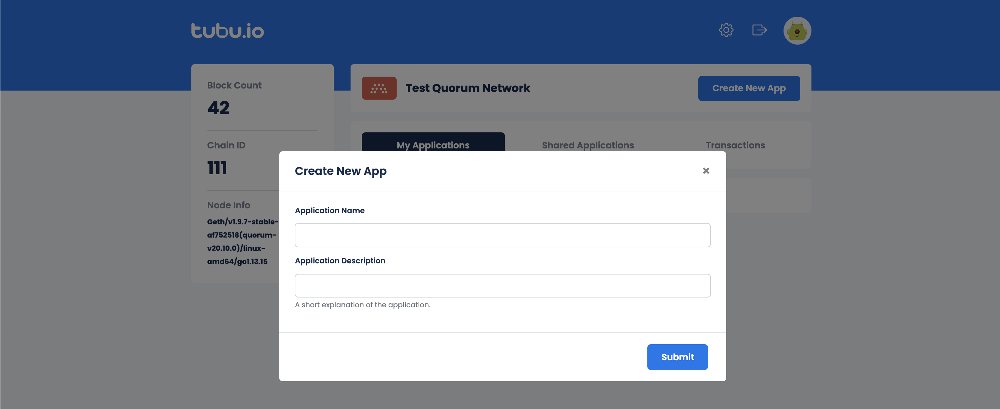

Creating your First Dapp is a really simple flow 
All you have to do is to follow the steps below

## Connect Available Network

You will face two different network with different Quorum Blockchain versions. 
Click on use button to continue with one of them.

## Create a new application
In this step, you are expected to create a new application or select one from the listed existing applications. 

Click the detail button  to carry on with an existing application

## Deploy Contract
You are now facing the deploy contract screen???? In this stage, 
you can select one of the contracts we provided from sample contracts tab or
upload your own contract to go from custom contracts tab

### Sample Contracts

### Custom Contracts

