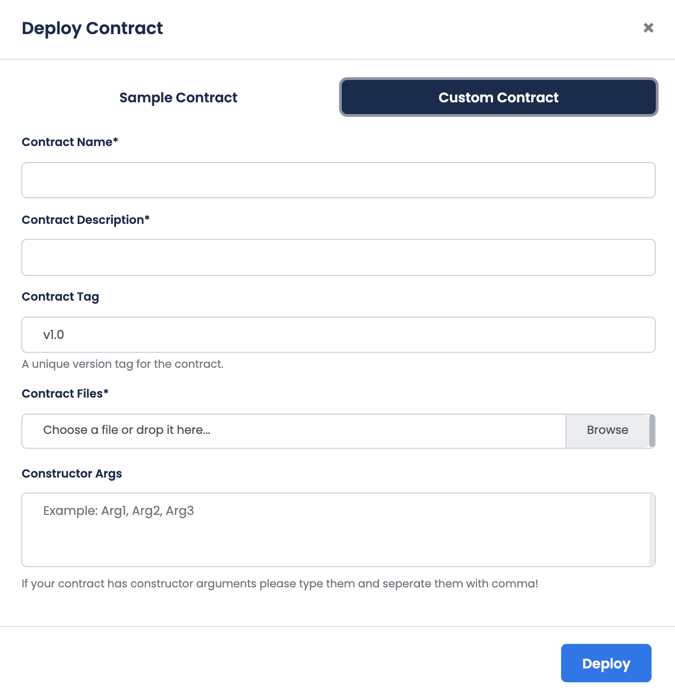

Creating your First Dapp is a really simple flow 
All you have to do is to follow the steps below

## Connect Available Network

You will face two different network with different Quorum Blockchain versions. 
Click on use button to continue with one of them.

## Create a new application
In this step, you are expected to create a new application or select one from the listed existing applications. 

Click the detail button  to carry on with an existing application

After you create and select your desired application, you will face the application details screen. In this stage, 
you can deploy a brand new smart contract by clicking deploy new contract  button or select an existing one by clicking view  button.

## Deploy Contract
When it comes to deploying contract, there are two options. Deploying a contract from sample contracts tab, or deploying a custom new contract from custom contracts tab.

### Sample Contracts
Here you can see the sample contracts provided by us for you to deploy. 

You can select the contract you desire to continue deploying process by clicking on the  button.

After you select the contract, a modal will pop-up for you to provide the details to the contract. Regarding details are the name, description, tag(optional) and the constructor parameters(if they exist in the contract) of the contract.

Clicking on  button will finish the deployment process. Then you can see your freshly deployed contract in the application details screen.

### Custom Contracts
If you want to deploy your own contract, custom contracts tab welcomes you to continue.

After you fill the name, description, tag of the contract, you are expected to upload the contract (.sol file). Afterwards, you have to provide the constructor parameters of your contract (if they exist in the contract). 

Clicking on  button will finish the deployment process. Then you can see your freshly deployed contract in the application details screen.