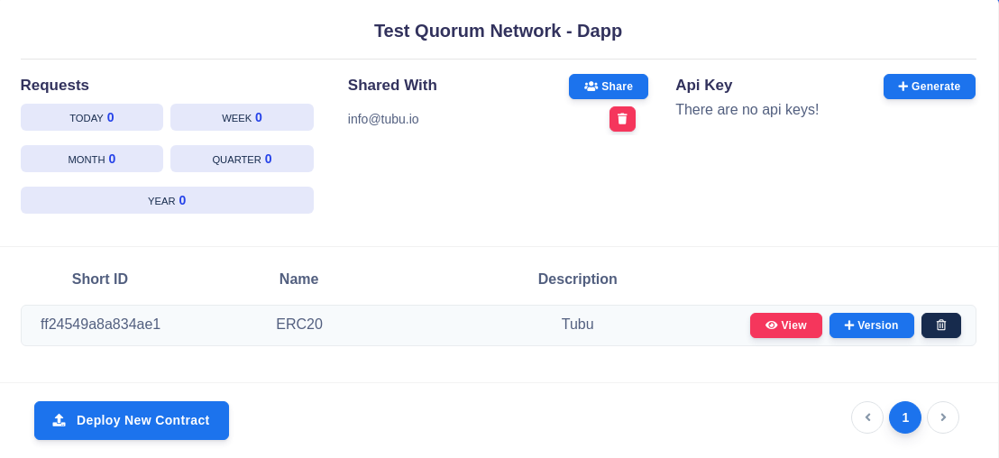
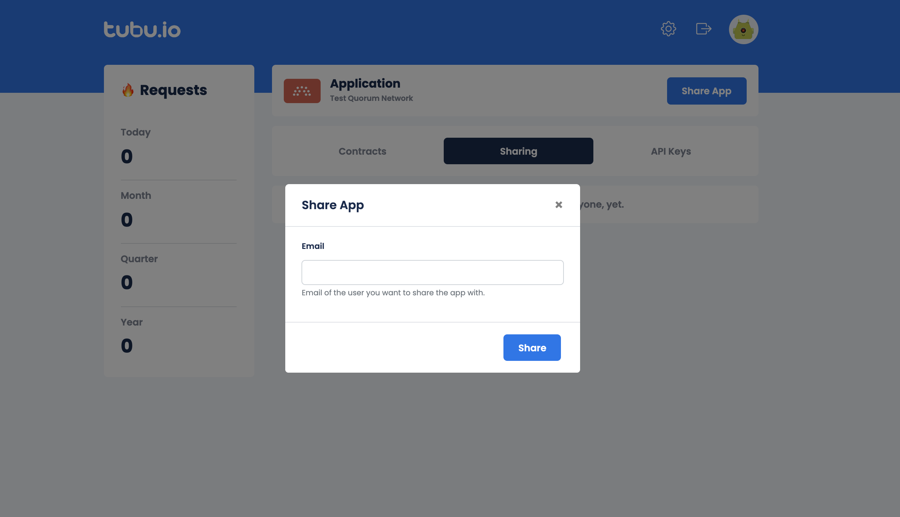
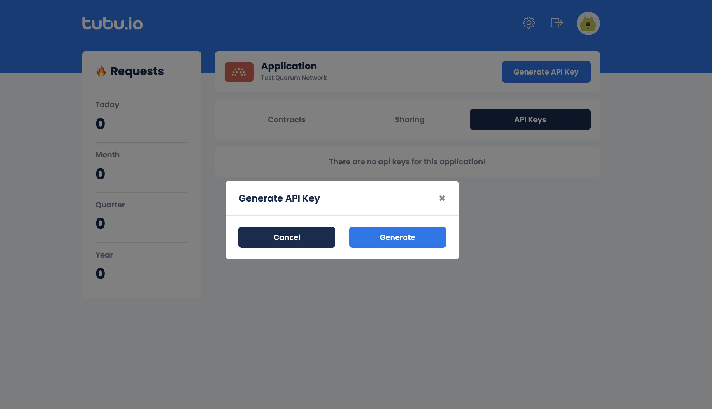
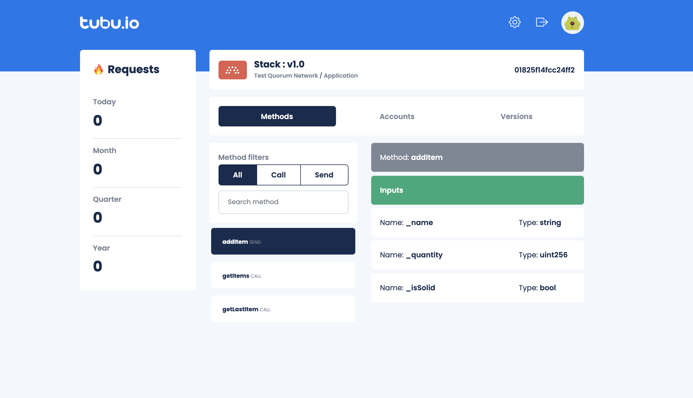
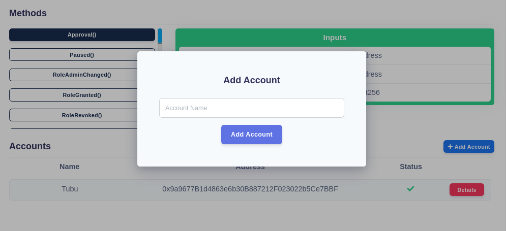

After you deploy your contract, you will naturally want to interact wit your contract. Invoke or Call the methods in it.
Application details page provides every necessary information to interact with your contract.

## Share Application
If you want your contracts to be managed by others, you can always share them! If you click on  button, a screen will appear for you to provide the e-mail address of the person you want to co-operate with on your application. 

## Create Api Key
You will have to have an Api Key for the application in order to interact with the contracts in it from the SDK side. To create an Api Key, click on the  button. Afterwards, click Generate to confirm, Cancel to revert.

## Deploying New Version 
You can deploy a new version to a pre-deployed contract. After deploying, you will access to the latest deployed contract by default. If you want to access a spesific version from the SDK, you will have to provide the tag you entered while deploying the version. If you haven't provided a tag in first deployment of the contract, the default tag is 'v1.0'. You can see your versions in the Contract Details page. 

In order to deploy a new version, you have to click on the  button. That will open up a modal just like the one back in the deploying contract process. You have to provide the necessary information (this time the tag is obligatory) in the model, select your contract and deploy it. 

## Accessing Contract Details
In order to see the methods, versions, accounts of the contract, you can click on  button. Clicking on that button will direct you to contract details page.

Here you can see the total request number, the versions, the methods, method inputs and method outputs and the accounts of the contract. You can click on the method name to see the inputs and outputs of the method. If you want to add an account to the contract, just click on   button and type the name of the account to the field in the opened model.

## Using SDKs
You can call or invoke the methods in your smart contract via the SDKs. You can see more information about the SDKs in the links below.

  - [NodeJS](/node)
  - [Go](/go)