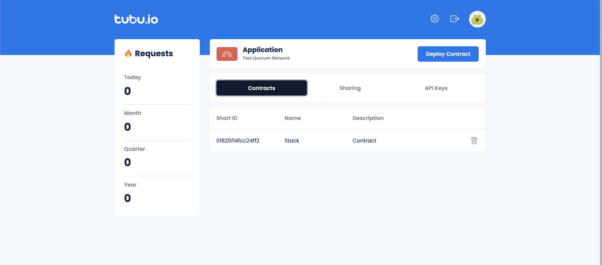
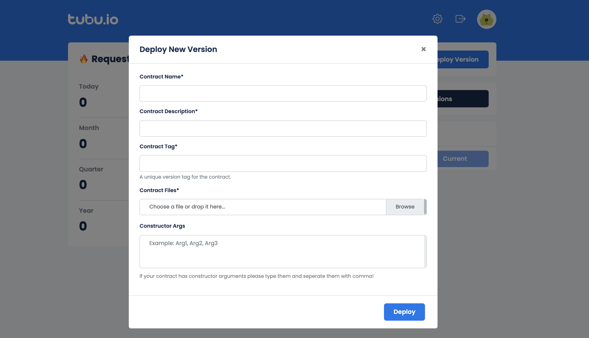
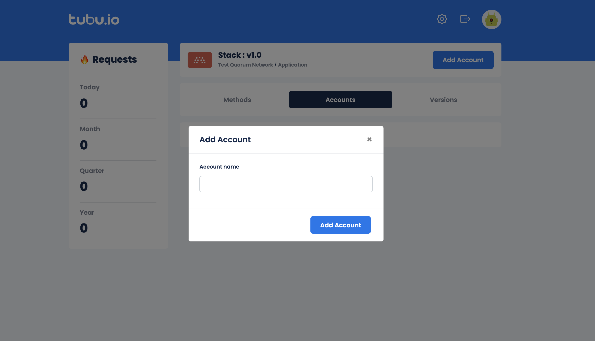

After you deploy your contract, you will naturally want to interact wit your contract. Invoke or Call the methods in it.
Application details page provides every necessary information to interact with your contract in Contracts, Sharing and API Keys tabs.

## Share Application

If you want your contracts to be managed by others, you can always share them! If you click on Sharing tab in the application details screen. There you will see the users that the application is shared with. In order to share the application with other users, click on the  button, a screen will appear for you to provide the e-mail address of the person you want to co-operate with on your application.

In addition, there are going to be some applications that are shared with you, you can access those applications from the Shared Application tab of the Network Details page.

## Create Api Key

You will have to have an Api Key for the application in order to interact with the contracts in it from the SDK side. To create an Api Key, click on the  button in the API Key tab. Afterwards, click Generate to confirm, Cancel to revert.

## Deploying New Version

You can deploy a new version to a pre-deployed contract. After deploying, you will access to the latest deployed contract by default. If you want to access a spesific version from the SDK, you will have to provide the tag you entered while deploying the version. If you haven't provided a tag in first deployment of the contract, the default tag is 'v1.0'. You can see your versions in the Contract Details page.

In order to deploy a new version, you have to click on the contract and then navigate to the Versions tab in the contract detail page.Then you should click on the  button. That will open up a modal just like the one back in the deploying contract process. You have to provide the necessary information (this time the tag is obligatory) in the model, select your contract and deploy it.

## Accessing Contract Details

In order to see the methods, versions, accounts of the contract, you can click on the contract in the Application Detail list. There you will see three tabs that are Methods, Accounts and Versions.

Here you can see the total request number at the left side. The versions of the current contract is listed in the Versions tab. The methods, method inputs and method outputs are available in the Methods tab and the Accounts of the contract contains the account related operations and the information. In the Methods tab, you can click on the method name to see the inputs and outputs of the method. You can also filter the methods accourding to their name or type. If you want to add an account to the contract, just navigate to the Account tab and click on the  button and type the name of the account to the field in the opened model.

## Using SDKs

You can call or invoke the methods in your smart contract via the SDKs. You can see more information about the SDKs in the links below.

- [NodeJS](/node)
- [Go](/go)
